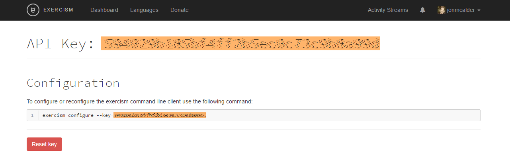

---
output:
  github_document
---

<!-- README.md is generated from README.Rmd. Please edit that file -->

```{r, echo = FALSE}
knitr::opts_chunk$set(
  collapse = TRUE,
  comment = "#>",
  fig.path = "man/figures"
)
```

# exercism

[](http://www.repostatus.org/#wip)
[](https://travis-ci.org/jonmcalder/exercism)
[](https://ci.appveyor.com/project/jonmcalder/exercism)
[](https://codecov.io/gh/jonmcalder/exercism)


This package is designed to make it easy for R users to work through the R track on [exercism.io](http://exercism.io).

It is not a complete replacement for the [Exercism CLI](http://exercism.io/clients/cli), but instead provides easy access to the most commonly used CLI functionality:

- fetch problems
- skip problems
- submit solutions
- check status/progress

## Install

```
devtools::install_github("jonmcalder/exercism")
library(exercism)
```

## Setup

There are two essential steps which must be completed before you can make use of 
this R package:

- set your API key
- set your exercism path

#### Set your API key

Go to [exercism.io -> account -> API key](http://exercism.io/account/key)



Copy your API key (highlighted above in orange), and then run:

```
set_api_key("<your_API_key>")
# e.g.
# set_api_key("1a2b3c4d5e6f7g8h1a2b3c4d5e6f7g8h")
```

#### Set exercism path
```
set_exercism_path("<path_to_your_exercism_directory>")
# e.g. 
# set_exercism_path("C:/Users/Jon/exercism") # Windows example
# set_exercism_path("~/exercism")            # Mac & Linux example
# set_exercism_path()                        # Use default
```
Note that the `exercism_path` referred to here should be the root directory for 
exercism (i.e. not the `R` sub-directory).

By default the exercism command-line client (CLI) fetches exercises to 
`~/exercism`. If you have previously used the CLI and have not changed the 
default directory, then just run `set_exercism_path()` (i.e. with no 
path argument) and this will use the default exercism directory.

Once you've set your API key and exercism path these will be remembered for future R sessions.

## Usage

Note that all track-specific functions will default to the R track if the `track_id` argument is not specified.

#### Fetch problems

Get the next problem:

```
fetch_next()
```

Get a specific problem:

```
fetch_problem(slug = "leap")
fetch_problem(slug = "bob", track_id = "python")
```

#### Skip problems

```
skip_problem(slug = "bob")
skip_problem(slug = "hello-world", track_id = "python")
```

#### Submit problems

```
submit("C:/Users/Jon/exercism/r/leap/leap.R")
submit("C:/Users/Jon/exercism/python/anagram/anagram.py")
```

#### Check status

```
track_status()
track_status(track_id = "python")
```

## RStudio Addin

The core functionality mentioned above is also accessible via an RStudio Addin. 
You can access it via the Addins menu, or by running `exercism_addin()`.

## Contribute

If you encounter any problems while using this package please raise them on the [issues page](https://github.com/jonmcalder/exercism/issues). You can also use this page to offer any suggestions for improvement.
